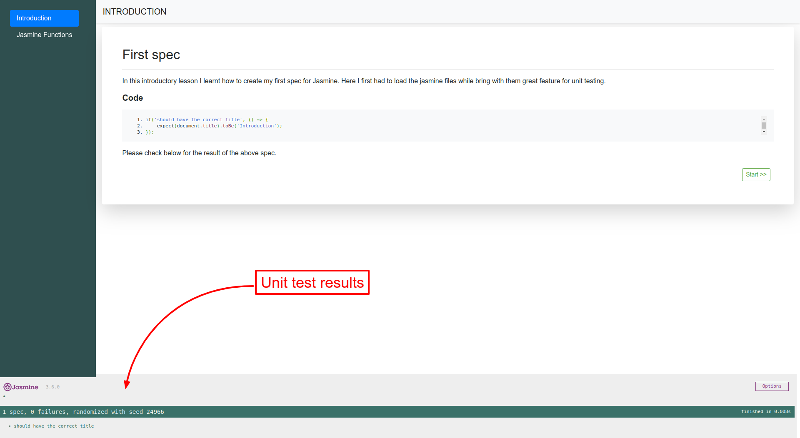

## About

### Brief

This repo demonstrates the lessons I went through while learning unit testing javascript with jasmine. The purpose of learning this is to be able to write tests for all my javascript projects. This will make debugging my code much easier, effective and efficient.

### Setup

Simply:
- Clone the repo 

```
git clone https://github.com/PeterKitonga/jasminelearning.git
```
- Navigate to the project and click on the `index.html` file of a lesson

### Illustration


### Tutorial
Visit [Udemy](https://www.udemy.com/course/unit-testing-your-javascript-with-jasmine) for the tutorial